# Iowa Liquor Sales Analysis

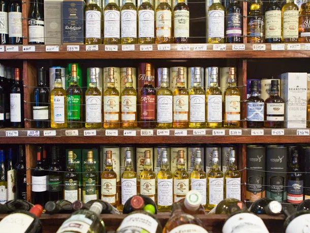

This project analyzes the Iowa Liquor Sales dataset using MySQL. The dataset contains detailed records of liquor sales in Iowa from Jan 2014 to Feb 2015, and a total of 15,000 rows. The analysis aims to uncover insights regarding product sales, vendor diversity, county-specific trends, and sales patterns over time.

## Dataset Source
https://www.kaggle.com/datasets/anandaramg/liquor-sales

## Questions and SQL Approach

### 1. How many total products are in the table?

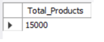

### 2. Who are the top most diverse vendors (i.e. they have the highest number of distinct products)? How many different products do they have?

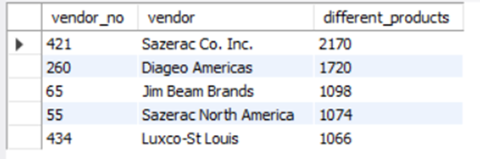

### 3. Which products sell the best by total number of unit sales? 

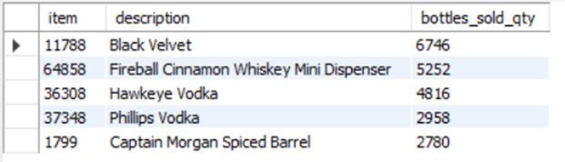

### 4. Which products sell the best by total dollar value of sales?

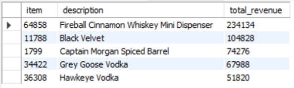

### 5. What are the top 10 categories of liquor sold based on the total amount of sales revenue?

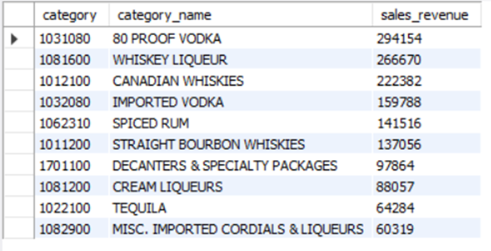

### 6. Which rum products have sales greater than $10,000? How about whiskey or vodka products?

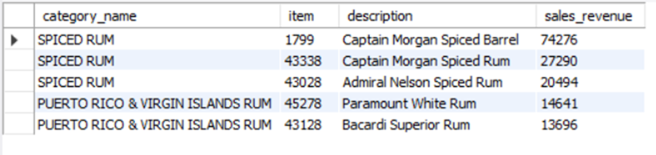

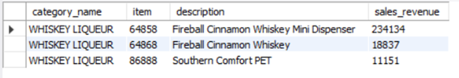

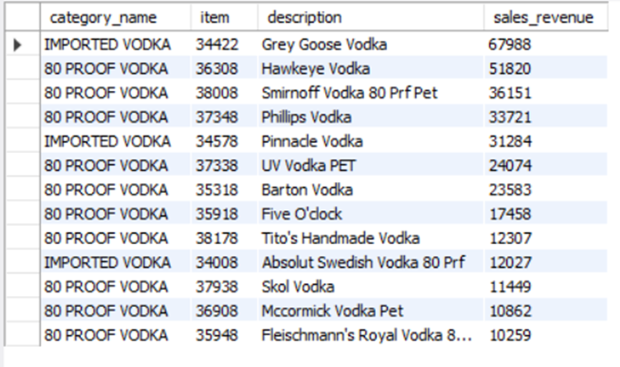

### 7. Which county sold the most amount of vodka during February 2014?

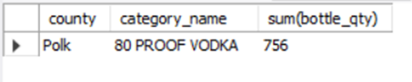

### 8. Which counties were in the top 10 counties for vodka sales in any month in 2014?

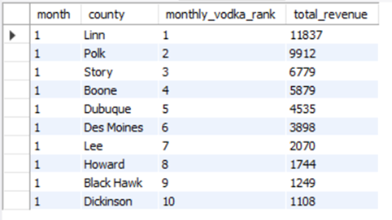

Note: The top 10 counties for vodka sales in January 2014 are shown in the picture above. You can filter to find results for other months in 2014.

### 9. Create a report that shows how many times a county appeared in the “top 10 counties for vodka sales in a month” list over the course of 2014.

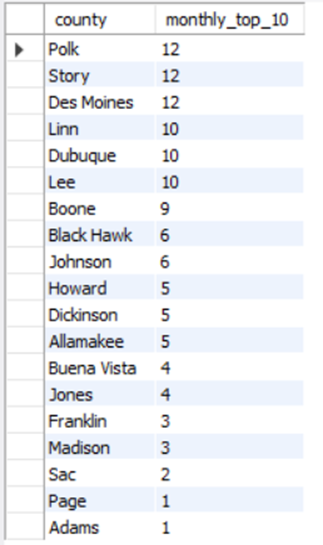

### 10. What is the trend of sales by month? Break up variables such as bottle_price into categories (for example: cheap, medium, or expensive).

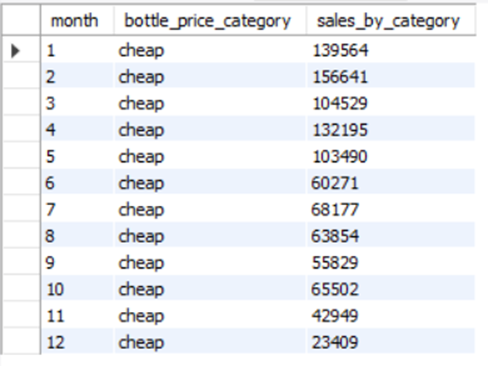

Note: 'cheap' category is shown in the picture above. You can filter to find results for other category.